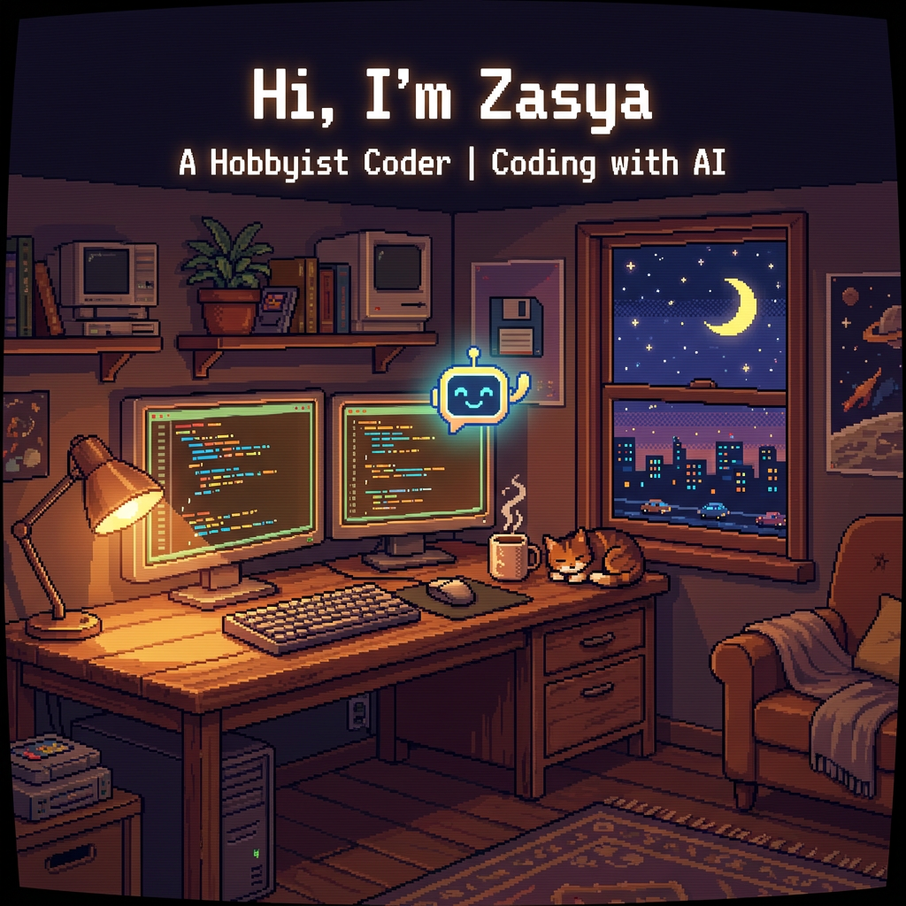

# 📝 TEMPLATE GITHUB PROFILE README PREMIUM (Edisi Kustom Lofi AI)

> **Petunjuk Penggunaan:** Salin seluruh isi file di dalam blok markdown di bawah ini (mulai dari `<p align="center">` sampai penutup) ke file `README.md` di repositori khusus Anda (yang namanya sama dengan username GitHub Anda, yaitu `airy-07`).
>
> **PENTING:** Pastikan Anda juga mengunggah berkas `banner.png` yang telah saya buat ke dalam repositori `airy-07` tersebut agar gambarnya otomatis tampil di bagian atas profil Anda!

---

```markdown
<p align="center">
  
</p>

<p align="center">
  
  
  
</p>

---

### 💫 Tentang Saya

Saya adalah seorang **Hobbyist Coder** yang senang mengulik baris kode bersama asisten AI (seperti Gemini, Claude, dan ChatGPT) untuk membangun berbagai ide menarik. Bagi saya, belajar pemrograman adalah hobi yang sangat seru dan menantang untuk mengisi waktu luang!

- 🔭 **Proyek Latihan yang Sedang Saya Kembangkan:**
  - **[Finance Airy](https://finance-airy.com/)** - Aplikasi pengelolaan keuangan pribadi berbasis AI (Tech Stack: Next.js & Firebase).
  - **Kost Airy** - Web manajemen & portal kost-kostan modern yang sedang saya pelajari pembuatannya.
- 🌱 **Fokus Belajar Saat Ini:** Belajar membuat website modern menggunakan Next.js, Tailwind CSS, dan Firebase dengan bantuan kecerdasan buatan (AI).
- ✉️ **Hubungi Saya:** [wanschool04@gmail.com](mailto:wanschool04@gmail.com)
- ⚡ **Fakta Menarik:** *"Hobi ngoding dibantu AI, hobi bikin bug diselesaikan AI juga! 🤖🚀"*

---

<h3 align="center">Technology Stack ⚡</h3>

<p align="center">
  
  
  
  
  
  
  
  
</p>

---

<h3 align="center">My GitHub Stats 📊</h3>

<p align="center">
  <a href="https://github.com/airy-07">
    
  </a>
  <a href="https://github.com/airy-07">
    
  </a>
</p>

<p align="center">
  <a href="https://github.com/airy-07">
    
  </a>
</p>

---

<p align="center">
  <a href="https://github.com/airy-07" target="blank">
    
  </a>
  <a href="mailto:wanschool04@gmail.com" target="blank">
    
  </a>
</p>
```

---

## 🚀 LANGKAH UNTUK MENERAPKANNYA DI GITHUB ANDA

### Langkah 1: Buat Repositori Khusus
1. Masuk ke halaman GitHub Anda, klik ikon **`+`** di pojok kanan atas lalu pilih **New repository**.
2. Beri nama repositori tersebut **`airy-07`** (harus sama persis dengan username Anda).
3. Pastikan repositori diatur ke **Public**.
4. Centang opsi **Add a README file**.
5. Klik **Create repository**.

### Langkah 2: Unggah Berkas Banner
1. Unggah berkas **`banner.png`** yang ada di folder ini ke repositori `airy-07` yang baru Anda buat.
2. Anda bisa melakukannya langsung di web GitHub dengan menekan tombol **Add file** -> **Upload files**, tarik file `banner.png`, lalu klik **Commit changes**.

### Langkah 3: Perbarui README.md
1. Buka file `README.md` yang ada di dalam repositori `airy-07` Anda di GitHub.
2. Klik ikon pensil (**Edit this file**).
3. Hapus semua teks bawaan, lalu **salin dan tempel (copy-paste)** seluruh isi kode di dalam blok abu-abu (markdown) di atas.
4. Klik **Commit changes...** di pojok kanan atas untuk menyimpan.
